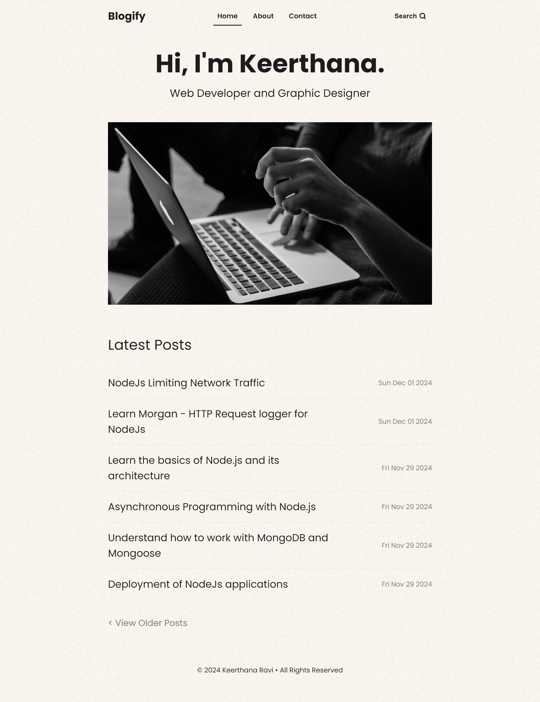

# Blogify - Blog Application

Blogify is a simple and functional blog website built using Node.js, Express, and MongoDB. 
It provides user authentication, CRUD operations for posts, and a basic admin dashboard for managing blog content.



## Features

- User login and authentication using JWT
- Admin panel to manage blog posts
- Post creation, editing, and deletion
- Uses EJS for templating and layout rendering
- Data is stored in MongoDB via Mongoose
- Middleware for session handling and secure authentication
- Responsive Design

## Technologies Used

- **Backend:** Node.js, Express.js
- **Frontend:** HTML, CSS, JavaScript, EJS (Embedded JavaScript Templates)
- **Database:** MongoDB, Mongoose
- **Authentication:** JWT (JSON Web Tokens), bcrypt
- **Session Management:** connect-mongo, express-session, cookie-parser
- **Routing:** method-override (for handling HTTP methods like DELETE and PUT)
- **Environment Variables:** dotenv

## You need

- NodeJs
- Database (MongoDB) Free Cluster

## Setup Database

- Sign up for MongoDB free database cluster: [MongoDB](https://www.mongodb.com/)

## Installation

1. Clone this repository to your local machine.

   ```bash
   git clone https://github.com/Keerthana2802/Blogify.git

   ```

2. Navigate to the project directory

   ```bash
   cd blogify
   ```

3. Install the dependencies:

   ```bash
   npm install
   ```

4. Create a .env file to store your credentials. Example below:
   ```bash
   SECRET_KEY=your-secret-key
   MONGODB_URI=your-mongodb-uri
   ```
5. Start the development server:

   ```bash
   npm run dev
   ```

6. Open your browser and navigate to http://localhost:5000 to see the app in action

## Routes

1. **GET /admin** - Admin login page (No Auth)
2. **POST /admin** - Check login and create JWT token (No Auth)
3. **GET /dashboard** - Admin dashboard, list of posts (Auth Required)
4. **GET /add-post** - Form to create a new post (Auth Required)
5. **POST /add-post** - Create a new post (Auth Required)
6. **GET /edit-post/:id** - Edit an existing post (Auth Required)
7. **PUT /edit-post/:id** - Update an existing post (Auth Required)
8. **POST /register** - Register a new admin user (No Auth)
9. **DELETE /delete-post/:id** - Delete a post (Auth Required)
10. **GET /logout** - Admin logout, clears JWT cookie (Auth Required)

## Contact

For any questions, please contact:

- Name: R.Keerthana
- Email: [keerthudhishal04@gmail.com](mailto:keerthudhishal04@gmail.com)
